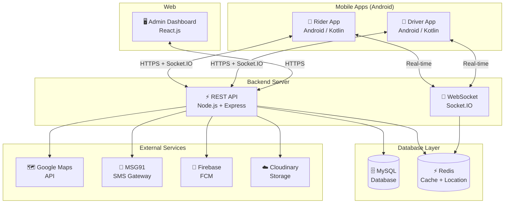
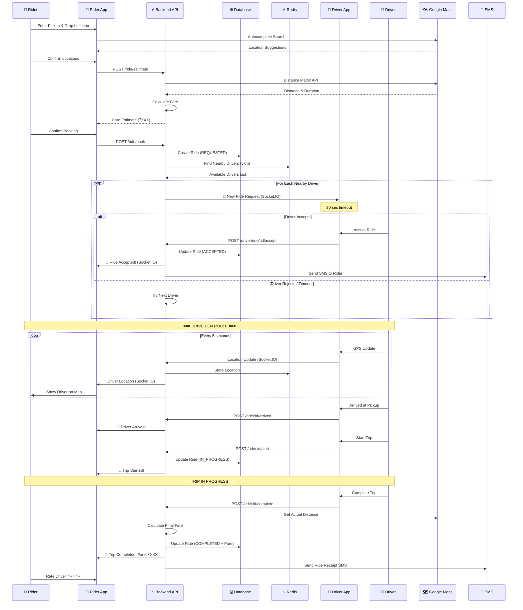
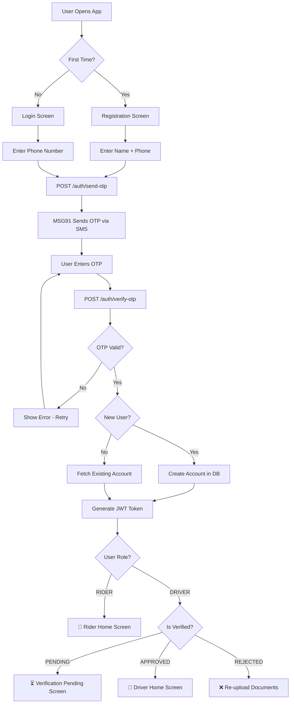
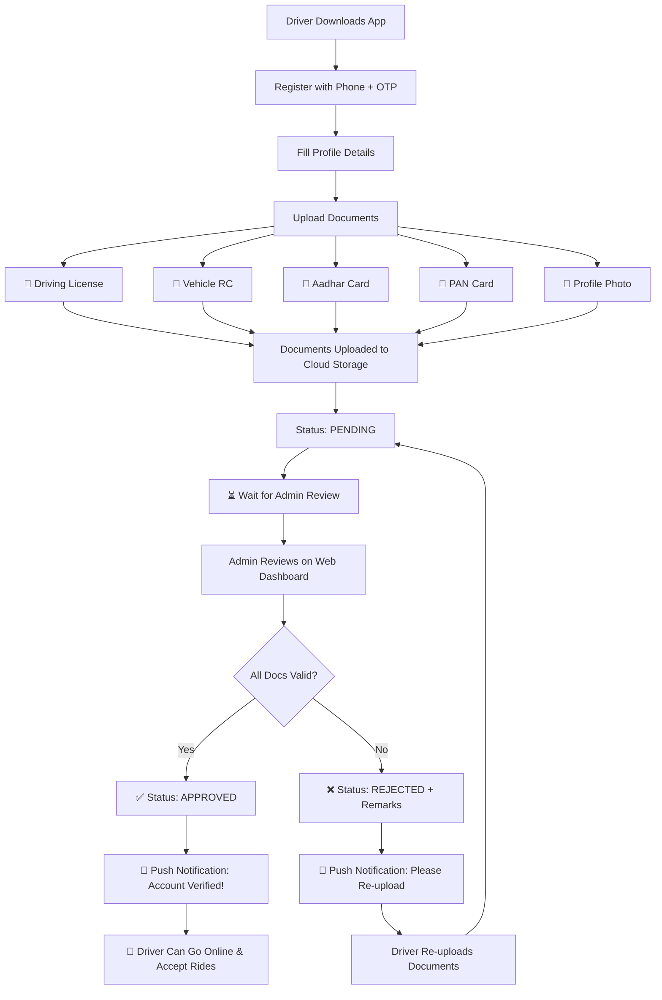
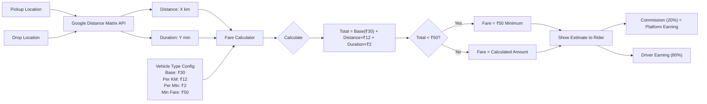
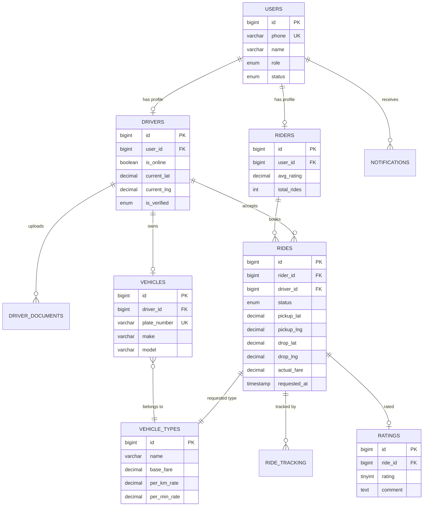
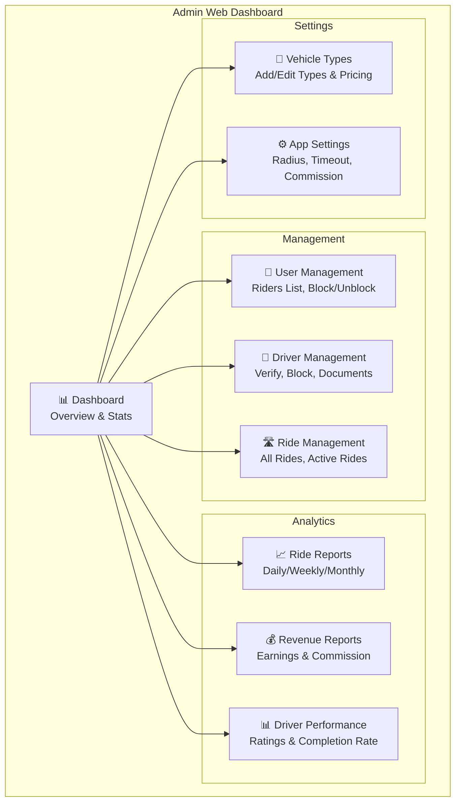
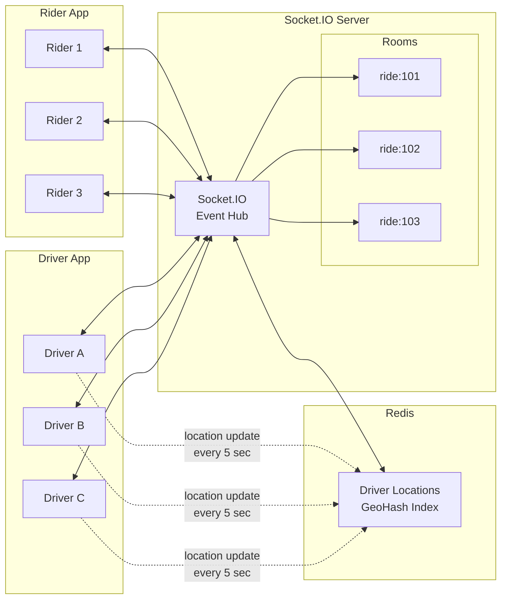
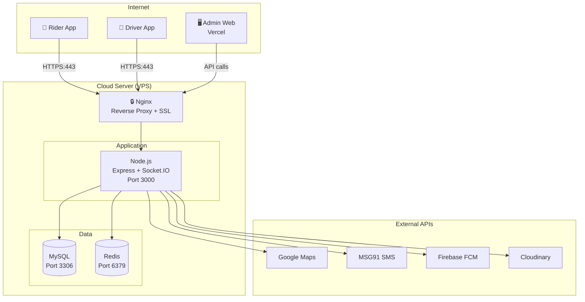
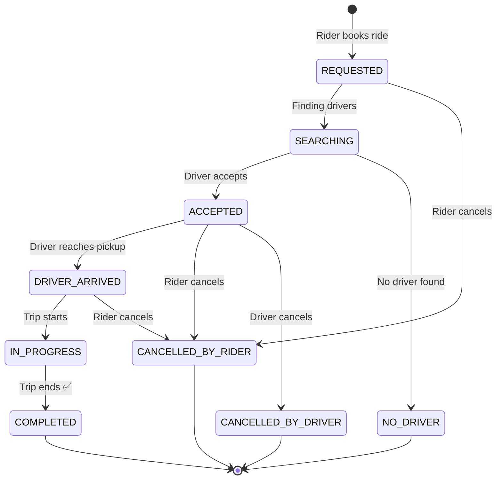

# 📊 Ride Book — Architecture & Flow Diagrams

> **Version:** 1.0 (MVP)  
> **Last Updated:** April 24, 2026  
> **Note:** All diagrams below are in Mermaid format. View them in any Mermaid-compatible viewer (GitHub, VS Code Mermaid Preview extension, mermaid.live)

---

## 1. System Architecture (High-Level)

---

## 2. Ride Booking Flow (Complete Journey)

---

## 3. User Authentication Flow

---

## 4. Driver Onboarding & Verification Flow

---

## 5. Fare Calculation Flow

---

## 6. Database Entity Relationship Diagram

---

## 7. Admin Dashboard Modules

---

## 8. Real-Time Communication Architecture

---

## 9. Deployment Architecture (MVP)

---

## 10. Ride Status State Machine

---

## How to View These Diagrams

1. **VS Code** — Install "Markdown Preview Mermaid Support" extension
2. **GitHub** — Push this file to GitHub, it renders Mermaid natively
3. **Online** — Copy mermaid code to [mermaid.live](https://mermaid.live)
4. **Export as Image** — Use mermaid.live to export PNG/SVG

---
